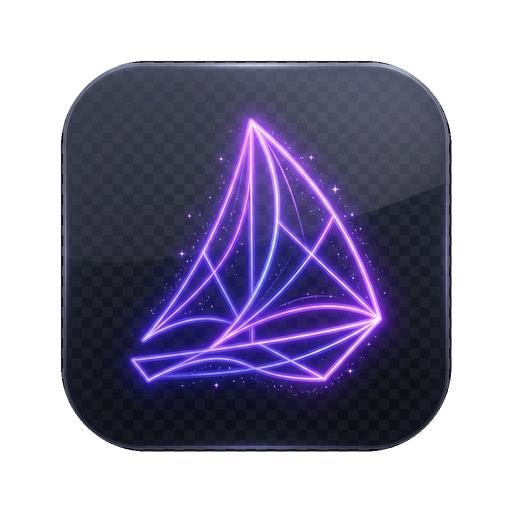
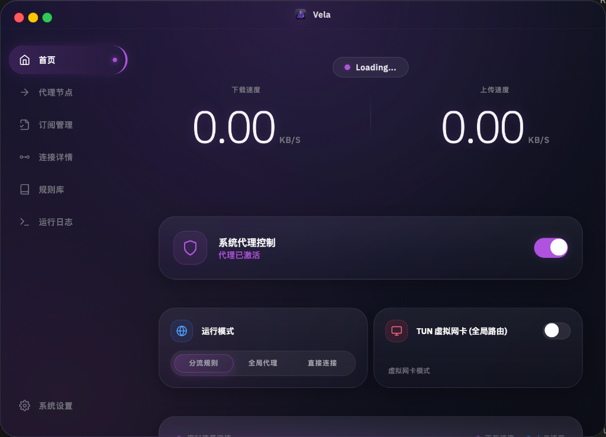
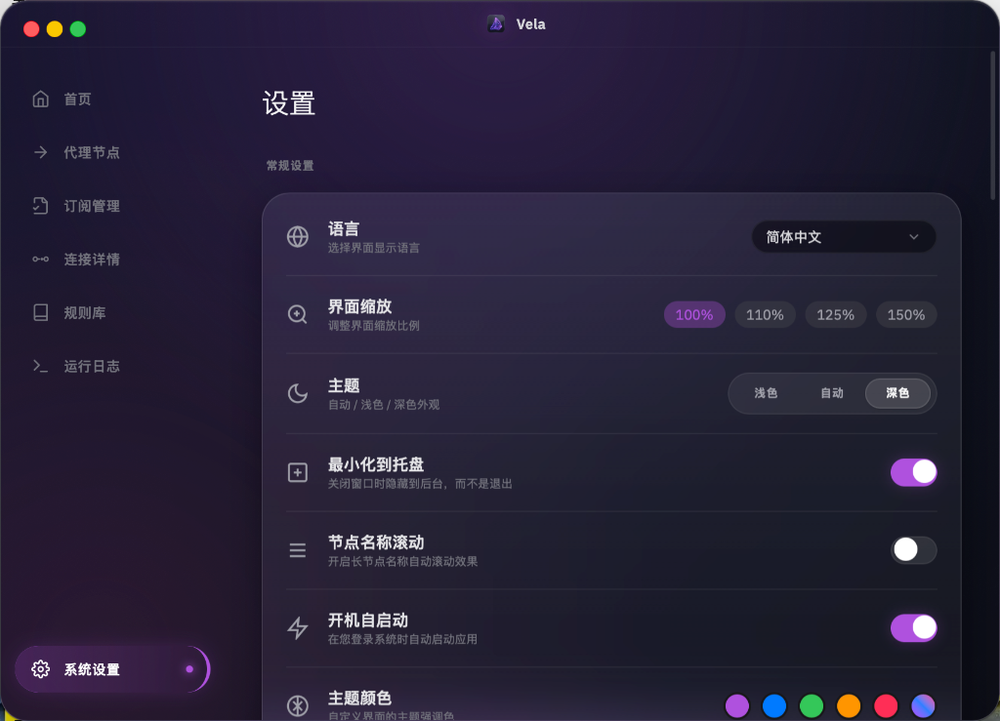
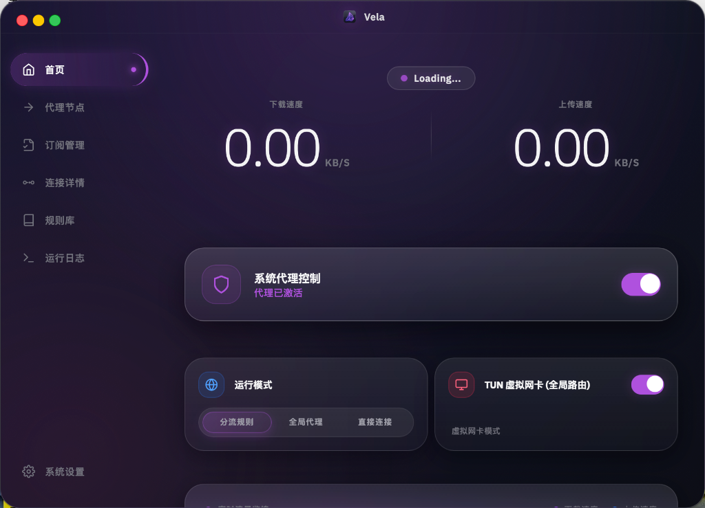

<div align="center">



# Vela

**安全至上 · 极简美学 · 轻量高效**

[English](README_en.md) | [简体中文](README.md)

> 一款为颜值而生、以安全为核的现代 Mihomo GUI 客户端，内置 Prism Engine 规则引擎。
>
> A modern, security-focused Mihomo (Clash Meta) GUI client built with Tauri v2, Rust, native JavaScript, Tailwind CSS, and Prism Engine.

[](LICENSE)
[](#安装)
[](https://tauri.app)
[](https://www.rust-lang.org/)
[](https://github.com/redbin1024/Vela/releases)
[](#安全设计)
[](https://github.com/redbin1024/Vela/actions)
[](https://github.com/redbin1024/Vela/actions)


</div>

---

## 项目状态

Vela 的开发起因很简单：目前我还没有找到符合自己审美的 Mihomo/Clash GUI，所以就自己 vibe coding 了一个。

这个项目首先服务于个人使用场景。它追求两件事：一个更顺眼的桌面代理管理界面，以及更清楚的安全边界，包括订阅下载、配置处理、文件写入、脚本执行、深链导入和更新校验。

本项目所有内容由 AI 生成（包括此段文字），安全性、稳定性和性能都不应被默认视为已经充分验证。使用前请自行评估风险；发现安全问题或 Bug，可以提交 Issue。PR 不保证合并，如果你有自己的需求，通常 Fork 后直接改会更快。

---

## 截图



<details>
<summary>更多截图</summary>

| 设置页面 | 深色模式 |
|:---:|:---:|
|  |  |

</details>

---

## 为什么选择 Vela？

Vela 不是"功能堆满就好"的客户端。它更关注三个方向：

- **视觉体验**：毛玻璃卡片、渐变图标、深色模式、动画细节和克制排版，让代理客户端不再像临时工具。
- **安全边界**：对订阅、配置、脚本、文件、更新和深链入口做明确限制，减少代理客户端常见攻击面。
- **规则能力**：内置 Prism Engine，用声明式规则补丁、规则库、智能节点选择和脚本沙箱扩展 Mihomo 配置能力。

详细功能清单见 [FEATURES.md](FEATURES.md)。

---

## 功能特性

### 核心能力

- **Mihomo 核心管理**：启动、停止、重启代理核心
- **多配置管理**：创建、编辑、切换 YAML 配置
- **订阅管理**：支持 URL、文件、二维码、拖拽导入和 Base64 自动解码
- **代理模式切换**：规则、全局、直连三种模式
- **系统代理**：Windows / macOS / Linux 原生系统代理管理
- **TUN 模式**：系统级透明代理能力
- **连接与流量**：实时连接列表、连接关闭、上下行速度和历史趋势

### Prism Engine

Vela 内置基于 `clash-prism-*` crate 的规则引擎，用来增强 Mihomo 配置管理：

- **声明式规则补丁**：`.prism.yaml` 支持 `$prepend`、`$append`、`$filter`、`$override` 和 `__when__` 条件
- **规则库管理**：规则文件 CRUD、分组、导入、自动应用和文件监听
- **智能节点选择**：基于延迟、成功率、稳定性的 EMA 评分与自适应调度
- **Failover**：节点失败时自动切换，支持阈值、冷却和回退策略
- **脚本沙箱**：QuickJS 执行环境，带时间、内存、字符串长度、循环和递归等资源限制
- **插件系统**：插件发现、加载、生命周期钩子和细粒度权限控制
- **KV 存储**：提供持久化键值存储能力

### 安全特性

- **机器绑定加密**：订阅元数据（URL、流量信息）加密使用硬件指纹派生密钥；代理配置文件（YAML）明文存储
- **SSRF 防护**：订阅和规则 URL 下载前进行 DNS 验证；重定向到内网地址会被拦截（用户主动输入内网地址允许）
- **DNS 防泄漏**：TUN 模式自动注入 `dns-hijack`，劫持所有 DNS 流量到 Mihomo
- **配置清洗**：递归移除危险 YAML 字段，限制 provider 路径遍历
- **脚本权限控制**：脚本执行受资源限制和权限限制约束
- **输入验证**：IPC 命令入口做长度、格式和 UTF-8 安全处理
- **速率限制**：双重限流 — 原有命令固定冷却时间 + Prism 命令滑动窗口
- **文件安全**：安全权限、UUID 临时文件、压缩包路径遍历防护、符号链接拒绝、压缩炸弹检测
- **更新完整性**：SHA256 校验、可信主机限制和资源名校验、原子更新与自动回滚
- **深链安全**：限制 `clash://` 协议入口和 URL scheme
- **CSP 与构建加固**：限制脚本和连接来源，release 启用 LTO、strip、`panic=abort`

### 系统集成

- 系统托盘状态图标和快捷菜单
- 全局快捷键：窗口显示、系统代理、TUN、代理模式切换
- `clash://` 深链订阅导入
- Windows UWP 环回免除
- Mihomo 核心、GeoIP / GeoSite 数据和 Vela 客户端更新
- 开机自启、系统通知、配置目录打开

### UI / UX

- 透明无边框窗口与自定义标题栏
- **UI 缩放**：0.5x - 2.0x 界面缩放，适配不同分辨率
- 虚拟滚动日志、分级过滤和正则搜索
- CodeMirror 6 编辑器，支持 Prism DSL 高亮与补全
- 代理节点卡片 3D 交互效果
- 主题系统：预设主题和自定义颜色
- i18n：英文基准、中文完整翻译，日文/韩文仍是骨架翻译并会回退到英文
- 前端事件总线、集中式状态和缓存层

---

## 技术栈

| 层级 | 技术 | 说明 |
|:---:|:---:|:---|
| 桌面框架 | Tauri v2 | 轻量桌面应用框架 |
| 后端 | Rust 1.92+ | IPC、系统集成、核心管理和安全边界 |
| 前端 | 原生 JavaScript | 无前端框架依赖 |
| 样式 | Tailwind CSS v4 | 现代原子化样式系统 |
| 编辑器 | CodeMirror 6 | Prism DSL 编辑体验 |
| 规则引擎 | clash-prism-* | 规则补丁、插件、脚本沙箱、智能选择 |
| 包管理 | pnpm workspace | `apps/*` + `packages/*` monorepo |
| 代理核心 | Mihomo | Clash Meta 内核 |

---

## 安装

从 [GitHub Releases](https://github.com/redbin1024/Vela/releases) 下载对应平台的安装包。

Vela 的发布包分为三类：

| 类型 | 说明 | 适用场景 |
|:---:|------|---------|
| **Full** | 包含 Mihomo 核心和 GeoIP / GeoSite 数据 | 首次安装、离线使用 |
| **Lite** | 体积更小，不包含核心资源 | 已有本地核心资源 |
| **Portable** | 解压即用，数据存储在程序目录 | U 盘携带、多设备使用 |

### 便携版使用

1. 下载 `Vela-windows-portable.zip` 或 `Vela-linux-portable.tar.gz`
2. 解压到任意目录
3. 确保目录中存在 `.portable` 标记文件
4. 运行可执行文件

> **便携版限制**：不支持开机自启和客户端内更新。详见 [PORTABLE.md](PORTABLE.md)。

平台支持以实际 Release 产物为准。

---

## 从源码运行

### 前置要求

- Rust 1.92 或更高版本
- Node.js 18 或更高版本
- pnpm 10 或更高版本
- 对应平台的 Tauri 系统依赖

### 开发模式

```bash
pnpm install
pnpm run dev
```

### 构建

```bash
pnpm run build
```

### 常用验证命令

```bash
pnpm run typecheck
pnpm run test
pnpm run lint
pnpm run check:i18n
```

桌面包也可以单独执行：

```bash
pnpm --filter @vela/desktop typecheck
pnpm --filter @vela/desktop test
pnpm --filter @vela/desktop lint
pnpm --filter @vela/desktop build:css
```

Rust 侧验证：

```bash
cd apps/desktop/src-tauri
cargo check
cargo test
cargo clippy --all-targets --all-features
```

---

## 项目结构

```text
.
├── apps/
│   └── desktop/                 # Tauri 桌面应用
│       ├── src/                 # 原生 JS 前端、样式、UI 模块
│       └── src-tauri/           # Rust 后端、IPC、系统集成、Prism 能力
├── packages/
│   ├── shared/                  # 前端共享代码
│   └── scripts/                 # 项目脚本，例如 i18n 检查
├── FEATURES.md                  # 当前功能清单
├── package.json                 # workspace 根脚本
└── pnpm-workspace.yaml          # pnpm workspace 配置
```

---

## 贡献

这个项目首先服务于个人使用场景，因此不会保证合并所有 PR。如果你有不同需求，更直接的方式通常是 Fork 后按自己的使用方式修改。

欢迎提交：

- 可复现的 Bug 报告
- 安全问题反馈
- 明确、边界清楚的小修复
- 不改变项目方向的质量改进

---

## License

本项目使用 [MIT License](LICENSE)。

---

## Acknowledgments

- [Mihomo](https://github.com/MetaCubeX/mihomo)
- [Tauri](https://tauri.app)
- [Tailwind CSS](https://tailwindcss.com)
- [CodeMirror](https://codemirror.net)
- [clash-prism-*](https://github.com/Juwan-Hwang/Clash-Prism-Engine) — Declarative rule engine for Clash

---

<div align="center">

**Conjured by Juwan**

[Back to Top](#vela)

</div>
